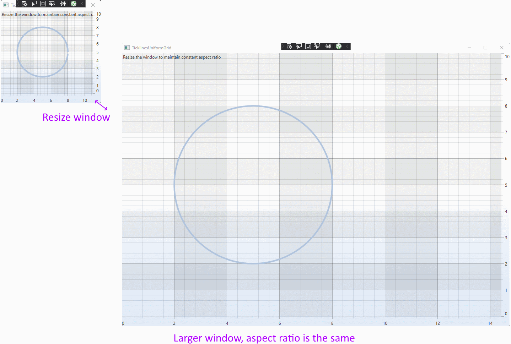

# Aspect Ratios in SciChart WPF

See the related [forum question here](https://www.scichart.com/questions/wpf/different-axis-scaling-in-not-squared-grid).

Sometimes we are asked to maintain a constant aspect ratio, to avoid stretching the figure drawn on a chart. 

There are two ways to do this:

1/ Is to ensure the SciChartSurface has a constant 1:1 aspect ratio, by placing it inside a uniform container

2/ Is to manipuate the axis.visiblerange

This example shows how to do the second option with some simple maths. 

Subscribe to Window.SizeChanged, next, calculate the xAxis.VisibleRange which will give a constant 1:1 aspect ratio if the window is resized. 

```
private void Window_SizeChanged(object sender, SizeChangedEventArgs e)
{
    var size = new Size(this.sciChart.GridLinesPanel.Width, this.sciChart.GridLinesPanel.Height);

    var yRange = yAxis.VisibleRange.AsDoubleRange();
    var xRange = xAxis.VisibleRange.AsDoubleRange();

    // We want to normalize xAxis.visiblerange.max so that 
    // (yRange.Max - yRange.Min) = (xRange.Max - xRange.Min)
    // ------------------------    -------------------------
    //         size.Height               size.Width

    var newXMax = (yRange.Max - yRange.Min) * size.Width / size.Height + xRange.Min;

    xAxis.VisibleRange = new DoubleRange(xRange.Min, newXMax);
}
```

This results in the following output 



THere are also options to [place the chart inside a uniform container](https://www.scichart.com/questions/wpf/keep-aspect-ratio-of-chart) or to use the [tickprovider API to maintain constant size gridlines](https://github.com/ABTSoftware/SciChart.Wpf.Examples/tree/SciChart_v6_Release/Sandbox/CustomerExamples/TicklinesUniformGrid) as well 